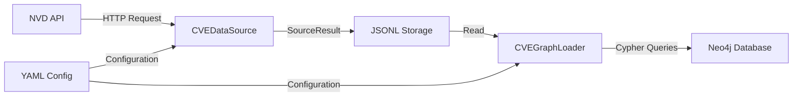
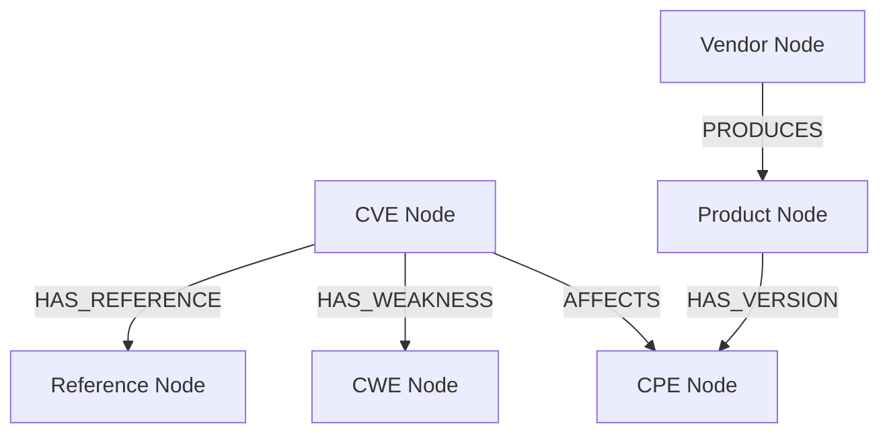

# Design Document

## Overview

CVE-Neo4j 통합 기능은 NVD (National Vulnerability Database)에서 CVE 데이터를 수집하고, 이를 Neo4j 그래프 데이터베이스에 로드하여 취약점 간의 관계를 분석할 수 있도록 합니다. 이 시스템은 기존 Zero-Day Defense 데이터 파이프라인 아키텍처를 확장하며, Palantir Ontology와 유사한 그래프 기반 분석 경험을 제공합니다.

## Architecture

### High-Level Architecture



### Component Layers

1. **Data Collection Layer**: NVD API와 통신하여 CVE 데이터 수집
2. **Storage Layer**: JSONL 형식으로 중간 데이터 저장
3. **Graph Loading Layer**: Neo4j에 그래프 구조로 데이터 변환 및 로드
4. **Configuration Layer**: YAML 기반 설정 관리

## Components and Interfaces

### 1. CVEDataSource

**Purpose**: NVD API 2.0을 통해 CVE 데이터를 수집하는 데이터 소스

**Class Structure**:
```python
class CVEDataSource(BaseDataSource):
    source_name: str = "nvd_cve"
    BASE_URL: str = "https://services.nvd.nist.gov/rest/json/cves/2.0"
    
    def __init__(
        self,
        *,
        timeout: float = 30.0,
        rate_limit_sleep: float = 6.0,
        api_key: Optional[str] = None,
        **kwargs
    )
    
    def collect_by_cve_id(self, cve_id: str, *, cutoff: datetime) -> SourceResult
    def collect_by_keyword(self, keyword: str, *, cutoff: datetime, max_results: int = 100) -> SourceResult
    def collect_by_cpe(self, cpe_name: str, *, cutoff: datetime, max_results: int = 100) -> SourceResult
    def collect(self, package: str, *, cutoff: datetime) -> SourceResult
```

**Key Features**:
- BaseDataSource 상속으로 기존 아키텍처와 통합
- 세 가지 수집 방식 지원: CVE ID, 키워드, CPE
- API 키 유무에 따른 동적 rate limit 조정 (6초 → 0.6초)
- cutoff_date 기반 시간적 필터링

**Rate Limiting Strategy**:
- API 키 없음: 6초 대기 (NVD 공개 rate limit)
- API 키 있음: 0.6초 대기 (50 requests per 30 seconds)

### 2. CVEGraphLoader

**Purpose**: JSONL 파일에서 CVE 데이터를 읽어 Neo4j 그래프로 변환

**Class Structure**:
```python
class CVEGraphLoader:
    def __init__(self, uri: str, username: str, password: str)
    def close(self)
    def create_constraints(self)
    def load_cve(self, cve_data: Dict[str, Any]) -> None
    def load_from_jsonl(self, jsonl_path: Path) -> None
```

**Key Features**:
- Neo4j Python driver 사용
- Uniqueness constraints를 통한 중복 방지 및 성능 최적화
- MERGE 패턴으로 멱등성(idempotency) 보장
- 배치 처리 및 진행 상황 로깅

### 3. Command-Line Scripts

#### collect_cve_data.py

**Purpose**: CVE 데이터 수집 실행

**Arguments**:
- `config`: YAML 설정 파일 경로 (필수)
- `--log-level`: 로깅 레벨 (기본: INFO)
- `--output`: 출력 파일 경로 오버라이드 (선택)

**Workflow**:
1. YAML 설정 로드
2. NVD API 키 확인 (config 또는 환경변수)
3. CVEDataSource 초기화
4. 각 CVE 타겟에 대해 데이터 수집
5. JSONL 형식으로 저장
6. 수집 통계 출력

#### load_cve_to_neo4j.py

**Purpose**: JSONL 데이터를 Neo4j에 로드

**Arguments**:
- `jsonl_file`: JSONL 파일 경로 (필수)
- `--uri`: Neo4j URI (기본: bolt://localhost:7687)
- `--username`: Neo4j 사용자명 (기본: neo4j)
- `--password`: Neo4j 비밀번호 (필수)
- `--log-level`: 로깅 레벨 (기본: INFO)

**Workflow**:
1. Neo4j 연결 설정
2. Uniqueness constraints 생성
3. JSONL 파일 읽기
4. 각 CVE에 대해 그래프 노드 및 관계 생성
5. 로드 통계 출력

## Data Models

### Neo4j Graph Schema

#### Node Types

**CVE Node**:
```cypher
(:CVE {
    id: String,                    // CVE-YYYY-NNNNN
    sourceIdentifier: String,      // 출처 (e.g., cve@mitre.org)
    published: DateTime,           // 공개 날짜
    lastModified: DateTime,        // 최종 수정 날짜
    vulnStatus: String,            // 상태 (e.g., "Analyzed")
    description: String,           // 영문 설명
    cvssVersion: String,           // CVSS 버전 (e.g., "3.1")
    cvssScore: Float,              // CVSS 점수 (0.0-10.0)
    cvssSeverity: String,          // 심각도 (LOW, MEDIUM, HIGH, CRITICAL)
    cvssVector: String             // CVSS 벡터 문자열
})
```

**CPE Node** (Common Platform Enumeration):
```cypher
(:CPE {
    uri: String,                   // CPE URI (unique)
    version: String,               // 버전 문자열
    versionStartIncluding: String, // 영향받는 버전 시작 (포함)
    versionEndExcluding: String    // 영향받는 버전 끝 (제외)
})
```

**CWE Node** (Common Weakness Enumeration):
```cypher
(:CWE {
    id: String                     // CWE-NNN (unique)
})
```

**Vendor Node**:
```cypher
(:Vendor {
    name: String                   // 벤더명 (unique)
})
```

**Product Node**:
```cypher
(:Product {
    vendor: String,                // 벤더명
    name: String                   // 제품명
    // (vendor, name) composite unique
})
```

**Reference Node**:
```cypher
(:Reference {
    url: String,                   // URL (unique)
    source: String                 // 출처
})
```

#### Relationship Types



**Relationship Descriptions**:
- `(:CVE)-[:AFFECTS]->(:CPE)`: CVE가 특정 CPE(제품 버전)에 영향을 미침
- `(:CVE)-[:HAS_WEAKNESS]->(:CWE)`: CVE가 특정 CWE 약점 유형과 연관됨
- `(:CVE)-[:HAS_REFERENCE]->(:Reference)`: CVE가 참조 링크를 가짐
- `(:Vendor)-[:PRODUCES]->(:Product)`: 벤더가 제품을 생산함
- `(:Product)-[:HAS_VERSION]->(:CPE)`: 제품이 특정 버전(CPE)을 가짐

### JSONL Data Format

각 레코드는 다음 구조를 따릅니다:

```json
{
    "source": "nvd_cve",
    "package": "CVE-2021-44228",
    "collected_at": "2025-10-15T12:34:56.789012",
    "payload": {
        "vulnerabilities": [
            {
                "cve": {
                    "id": "CVE-2021-44228",
                    "sourceIdentifier": "cve@mitre.org",
                    "published": "2021-12-10T10:15:09.000",
                    "lastModified": "2021-12-14T01:15:00.000",
                    "vulnStatus": "Analyzed",
                    "descriptions": [...],
                    "metrics": {...},
                    "weaknesses": [...],
                    "configurations": [...],
                    "references": [...]
                }
            }
        ],
        "total_results": 1
    },
    "metadata": {
        "description": "Log4Shell - Apache Log4j2 RCE",
        "target_id": "CVE-2021-44228"
    }
}
```

### Configuration Schema

**cve_config.yaml**:
```yaml
cutoff_date: "2021-12-31T23:59:59"
output_dir: "data/raw"
request_timeout: 30
rate_limit_sleep: 6.0
nvd_api_key: "optional-api-key"  # 또는 환경변수 NVD_API_KEY

cve_targets:
  - id: "CVE-2021-44228"
    description: "Log4Shell"
  - id: "keyword:log4j"
    description: "All Log4j CVEs"
  - id: "cpe:2.3:a:apache:log4j:2.14.1:*:*:*:*:*:*:*"
    description: "Log4j 2.14.1 specific"
```

## Error Handling

### Data Collection Errors

**Strategy**: Fail-safe with logging

1. **Network Errors**:
   - BaseDataSource의 _request 메서드가 처리
   - 429 (Rate Limit) 발생 시 자동 재시도
   - 기타 HTTP 에러는 DataSourceError 발생

2. **CVE Not Found**:
   - DataSourceError 발생
   - 로그에 기록하고 다음 타겟으로 진행

3. **Invalid Response**:
   - JSON 파싱 실패 시 예외 발생
   - 로그에 기록하고 다음 타겟으로 진행

4. **Timeout**:
   - requests timeout 설정 (기본 30초)
   - 타임아웃 발생 시 예외 발생 및 로깅

**Error Logging**:
```python
try:
    result = cve_source.collect(cve_id, cutoff=cutoff_date)
    collected_count += 1
except Exception as e:
    logger.error(f"Error collecting {cve_id}: {e}")
    error_count += 1
    continue
```

### Neo4j Loading Errors

**Strategy**: Transaction-based with constraint handling

1. **Connection Errors**:
   - Neo4j driver가 자동으로 재연결 시도
   - 연결 실패 시 명확한 에러 메시지 출력

2. **Constraint Violations**:
   - MERGE 사용으로 중복 방지
   - Constraint 생성 실패는 경고로 처리 (이미 존재할 수 있음)

3. **Invalid Data**:
   - CVE ID 없는 레코드는 스킵
   - 로그에 경고 기록

4. **Cypher Query Errors**:
   - 각 CVE 로드를 try-except로 감싸서 격리
   - 하나의 CVE 실패가 전체 프로세스를 중단하지 않음

**Error Logging**:
```python
try:
    self.load_cve(cve_data)
    count += 1
except Exception as e:
    logger.error(f"Error loading CVE: {e}")
```

## Testing Strategy

### Unit Testing

**CVEDataSource Tests**:
- Mock NVD API 응답을 사용한 각 수집 메서드 테스트
- cutoff_date 필터링 로직 검증
- Rate limit 처리 검증
- API 키 유무에 따른 동작 차이 검증

**CVEGraphLoader Tests**:
- Mock Neo4j driver를 사용한 로드 로직 테스트
- CPE 파싱 로직 검증
- Cypher 쿼리 생성 검증
- 중복 데이터 처리 검증

### Integration Testing

**End-to-End Data Flow**:
1. 테스트용 CVE 데이터 수집 (실제 NVD API 또는 mock)
2. JSONL 파일 생성 검증
3. Neo4j 테스트 인스턴스에 로드
4. Cypher 쿼리로 데이터 무결성 검증

**Sample Verification Queries**:
```cypher
// CVE 노드 수 확인
MATCH (c:CVE) RETURN count(c)

// Log4Shell 관계 확인
MATCH (c:CVE {id: 'CVE-2021-44228'})-[r]->(n)
RETURN type(r), labels(n), n LIMIT 10

// 특정 벤더의 취약점 수
MATCH (v:Vendor {name: 'apache'})-[:PRODUCES]->(p:Product)
      <-[:HAS_VERSION]-(cpe:CPE)<-[:AFFECTS]-(c:CVE)
RETURN p.name, count(DISTINCT c) as vuln_count
ORDER BY vuln_count DESC
```

### Manual Testing

**Test Scenarios**:
1. 소규모 CVE 세트로 전체 파이프라인 실행
2. Neo4j Browser에서 그래프 시각화 확인
3. 다양한 Cypher 쿼리로 관계 탐색
4. Rate limit 테스트 (API 키 있음/없음)
5. 에러 시나리오 테스트 (잘못된 CVE ID, 네트워크 오류 등)

## Performance Considerations

### Data Collection

**Bottleneck**: NVD API rate limits
- API 키 없음: ~10 requests/minute
- API 키 있음: ~50 requests/30 seconds

**Optimization**:
- 병렬 처리는 rate limit 때문에 효과 제한적
- 대신 배치 수집 및 재개 기능 고려 (향후 개선)

### Neo4j Loading

**Bottleneck**: Cypher 쿼리 실행 시간

**Optimization**:
1. Uniqueness constraints로 인덱스 자동 생성
2. MERGE 사용으로 중복 체크 최적화
3. 배치 크기 조정 가능 (현재는 개별 트랜잭션)

**Future Improvements**:
- Batch insert using UNWIND
- Transaction batching (예: 100개 CVE당 1 트랜잭션)
- Parallel loading with connection pooling

## Security Considerations

1. **API Key Management**:
   - 환경변수 사용 권장
   - 설정 파일에 저장 시 .gitignore 추가 필요

2. **Neo4j Credentials**:
   - 명령줄 인자로만 전달 (설정 파일에 저장 금지)
   - 환경변수 사용 고려

3. **Input Validation**:
   - CVE ID 형식 검증 (CVE-YYYY-NNNNN)
   - URL 및 문자열 이스케이핑 (Neo4j driver가 자동 처리)

4. **Rate Limiting**:
   - NVD API 남용 방지를 위한 적절한 대기 시간 설정

## Deployment Considerations

### Prerequisites

1. **Python Environment**:
   - Python 3.10+
   - Dependencies: pyyaml, requests, tqdm, neo4j

2. **Neo4j Installation**:
   - Neo4j Desktop 또는 Docker
   - 최소 버전: 4.x+
   - 권장: 5.x+ (constraint 문법 지원)

3. **NVD API Key** (선택):
   - https://nvd.nist.gov/developers/request-an-api-key

### Installation Steps

```bash
# 1. 의존성 설치
pip install -r requirements.txt

# 2. Neo4j 설치 (Docker 예시)
docker run -d \
  --name neo4j \
  -p 7474:7474 -p 7687:7687 \
  -e NEO4J_AUTH=neo4j/password \
  neo4j:latest

# 3. CVE 데이터 수집
python scripts/collect_cve_data.py config/cve_config.yaml

# 4. Neo4j에 로드
python scripts/load_cve_to_neo4j.py data/raw/cve_data.jsonl --password password
```

### Monitoring

**Logging**:
- 모든 스크립트는 Python logging 사용
- 로그 레벨 조정 가능 (--log-level)
- 수집/로드 통계 자동 출력

**Metrics to Track**:
- 수집된 CVE 수
- 수집 실패 수
- Neo4j 로드 시간
- 생성된 노드/관계 수

## Future Enhancements

1. **Incremental Updates**:
   - 이미 수집된 CVE 스킵
   - lastModified 기반 업데이트 감지

2. **Advanced Graph Queries**:
   - 취약점 전파 경로 분석
   - 유사 CVE 클러스터링
   - 시간에 따른 취약점 트렌드

3. **Integration with Existing Pipeline**:
   - 패키지 데이터와 CVE 연결
   - GitHub 이슈/PR과 CVE 매핑

4. **Visualization**:
   - Neo4j Bloom 통합
   - 커스텀 대시보드 개발

5. **Performance**:
   - 비동기 데이터 수집
   - 배치 Neo4j 로딩
   - 캐싱 레이어 추가
