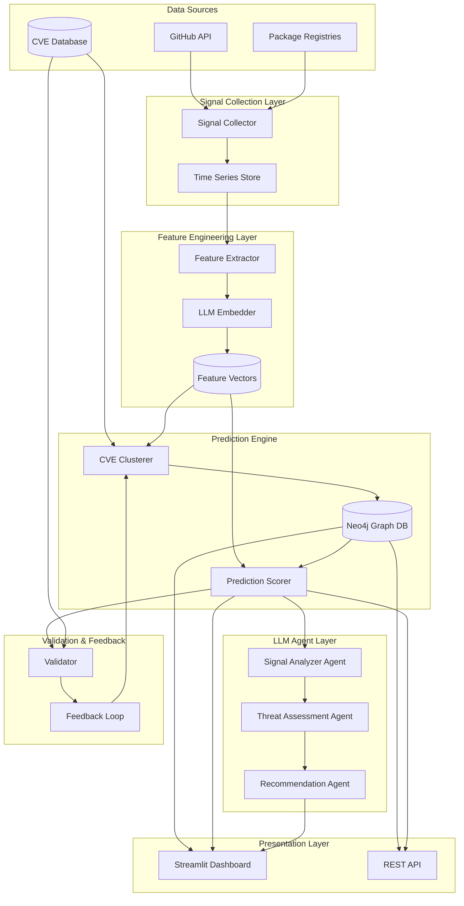

# Design Document

## Overview

Zero-Day Defense 예측 시스템은 시간적 신호 분석을 통해 CVE 공개 이전에 잠재적 취약점을 예측하는 LLM 기반 지능형 시스템입니다. 시스템은 4개의 주요 레이어로 구성됩니다:

1. **Signal Collection Layer**: GitHub API를 통한 시계열 데이터 수집
2. **Feature Engineering Layer**: 신호를 다차원 특징 벡터로 변환
3. **Prediction Engine**: CVE 클러스터 기반 위협 예측
4. **LLM Agent Layer**: 컨텍스트 기반 위협 분석 및 시나리오 생성

시스템은 기존 Neo4j 그래프 데이터베이스를 활용하여 CVE, 패키지, 의존성 관계를 저장하고, 새로운 시계열 신호 데이터와 특징 벡터를 추가로 저장합니다.

## Architecture

### High-Level Architecture



### Data Flow

1. **Signal Collection**: GitHub API → Signal Collector → Time Series Store (JSONL)
2. **Feature Extraction**: Time Series → Feature Extractor → LLM Embedder → Feature Vectors (Neo4j)
3. **Clustering**: Historical CVE Features → CVE Clusterer → Cluster Metadata (Neo4j)
4. **Prediction**: Current Package Features → Prediction Scorer → Threat Scores (Neo4j)
5. **Analysis**: High-Risk Packages → LLM Agents → Threat Reports (Neo4j)
6. **Validation**: Predictions + Actual CVEs → Validator → Performance Metrics (Neo4j)

## Components and Interfaces

### 1. Signal Collection Layer

#### GitHubSignalCollector

시간적 신호를 GitHub API에서 수집하는 컴포넌트입니다.

```python
class GitHubSignalCollector(BaseDataSource):
    """Collect time-series signals from GitHub repositories."""
    
    def collect_commit_history(
        self,
        repo: str,
        since: datetime,
        until: datetime,
    ) -> List[CommitSignal]:
        """Collect commit history within time range."""
        
    def collect_pr_history(
        self,
        repo: str,
        since: datetime,
        until: datetime,
    ) -> List[PRSignal]:
        """Collect pull request history."""
        
    def collect_issue_history(
        self,
        repo: str,
        since: datetime,
        until: datetime,
    ) -> List[IssueSignal]:
        """Collect issue discussion history."""
        
    def collect_release_history(
        self,
        repo: str,
        since: datetime,
        until: datetime,
    ) -> List[ReleaseSignal]:
        """Collect release history with dependency changes."""
```

#### PackageSignalCollector

패키지 레지스트리에서 메타데이터를 수집합니다.

```python
class PackageSignalCollector(BaseDataSource):
    """Collect package metadata from registries."""
    
    def collect_version_history(
        self,
        package: str,
        ecosystem: str,
        since: datetime,
        until: datetime,
    ) -> List[VersionSignal]:
        """Collect package version release history."""
        
    def collect_dependency_changes(
        self,
        package: str,
        ecosystem: str,
        version_from: str,
        version_to: str,
    ) -> DependencyDiff:
        """Collect dependency changes between versions."""
```

#### TimeSeriesStore

수집된 신호를 JSONL 형식으로 저장합니다.

```python
class TimeSeriesStore:
    """Store time-series signals in JSONL format."""
    
    def save_signals(
        self,
        package: str,
        signals: List[Signal],
        output_dir: Path,
    ) -> Path:
        """Save signals to JSONL file."""
        
    def load_signals(
        self,
        package: str,
        signal_type: str,
        input_dir: Path,
    ) -> List[Signal]:
        """Load signals from JSONL file."""
```

### 2. Feature Engineering Layer

#### FeatureExtractor

신호에서 구조적 특징을 추출합니다.

```python
class FeatureExtractor:
    """Extract structural features from signals."""
    
    def extract_commit_features(
        self,
        commits: List[CommitSignal],
    ) -> Dict[str, float]:
        """Extract features from commit history.
        
        Features:
        - commit_frequency: commits per day
        - lines_added_avg: average lines added
        - lines_deleted_avg: average lines deleted
        - file_types: distribution of changed file types
        - author_diversity: number of unique authors
        - commit_time_pattern: time of day distribution
        """
        
    def extract_pr_features(
        self,
        prs: List[PRSignal],
    ) -> Dict[str, float]:
        """Extract features from PR history.
        
        Features:
        - pr_frequency: PRs per week
        - pr_merge_time_avg: average time to merge
        - pr_review_count_avg: average number of reviews
        - pr_size_avg: average lines changed
        - security_label_ratio: ratio of security-labeled PRs
        """
        
    def extract_issue_features(
        self,
        issues: List[IssueSignal],
    ) -> Dict[str, float]:
        """Extract features from issue history.
        
        Features:
        - issue_frequency: issues per week
        - security_keyword_ratio: ratio with security keywords
        - response_time_avg: average time to first response
        - resolution_time_avg: average time to close
        - participant_count_avg: average participants per issue
        """
        
    def extract_dependency_features(
        self,
        releases: List[ReleaseSignal],
    ) -> Dict[str, float]:
        """Extract features from dependency changes.
        
        Features:
        - dependency_churn: rate of dependency changes
        - new_dependency_ratio: ratio of new dependencies
        - removed_dependency_ratio: ratio of removed dependencies
        - version_bump_pattern: major/minor/patch distribution
        """
        
    def extract_temporal_features(
        self,
        signals: List[Signal],
        window_days: int = 30,
    ) -> Dict[str, float]:
        """Extract time-series features.
        
        Features:
        - trend: linear regression slope
        - volatility: standard deviation
        - anomaly_score: isolation forest score
        - seasonality: FFT dominant frequency
        """
```

#### LLMEmbedder

텍스트 신호를 LLM 임베딩으로 변환합니다.

```python
class LLMEmbedder:
    """Generate semantic embeddings using LLM."""
    
    def __init__(self, model: str = "text-embedding-3-small"):
        self.model = model
        self.client = OpenAI()
        
    def embed_commit_messages(
        self,
        commits: List[CommitSignal],
    ) -> np.ndarray:
        """Generate embeddings for commit messages."""
        
    def embed_pr_descriptions(
        self,
        prs: List[PRSignal],
    ) -> np.ndarray:
        """Generate embeddings for PR titles and descriptions."""
        
    def embed_issue_discussions(
        self,
        issues: List[IssueSignal],
    ) -> np.ndarray:
        """Generate embeddings for issue discussions."""
        
    def aggregate_embeddings(
        self,
        embeddings: List[np.ndarray],
        method: str = "mean",
    ) -> np.ndarray:
        """Aggregate multiple embeddings into one vector."""
```

#### FeatureVectorBuilder

모든 특징을 통합하여 최종 특징 벡터를 생성합니다.

```python
class FeatureVectorBuilder:
    """Build unified feature vectors from all sources."""
    
    def build_vector(
        self,
        package: str,
        time_window: Tuple[datetime, datetime],
        structural_features: Dict[str, float],
        semantic_embeddings: np.ndarray,
    ) -> FeatureVector:
        """Build and normalize feature vector.
        
        Returns:
            FeatureVector with:
            - package: package name
            - time_window: (start, end)
            - structural: normalized structural features
            - semantic: semantic embedding vector
            - combined: concatenated normalized vector
            - metadata: additional context
        """
        
    def normalize_features(
        self,
        features: Dict[str, float],
    ) -> Dict[str, float]:
        """Normalize features using StandardScaler."""
```

### 3. Prediction Engine

#### CVEClusterer

과거 CVE 데이터를 클러스터링합니다.

```python
class CVEClusterer:
    """Cluster historical CVE data by vulnerability patterns."""
    
    def __init__(
        self,
        n_clusters: int = 10,
        algorithm: str = "kmeans",
    ):
        self.n_clusters = n_clusters
        self.algorithm = algorithm
        self.model = None
        
    def fit(
        self,
        cve_vectors: List[FeatureVector],
    ) -> ClusterModel:
        """Fit clustering model on historical CVE vectors."""
        
    def predict_cluster(
        self,
        vector: FeatureVector,
    ) -> Tuple[int, float]:
        """Predict cluster assignment and distance.
        
        Returns:
            (cluster_id, distance_to_centroid)
        """
        
    def get_cluster_metadata(
        self,
        cluster_id: int,
    ) -> ClusterMetadata:
        """Get cluster characteristics.
        
        Returns:
            ClusterMetadata with:
            - cluster_id: cluster identifier
            - centroid: cluster center vector
            - size: number of CVEs in cluster
            - dominant_cwe: most common CWE types
            - avg_cvss: average CVSS score
            - avg_epss: average EPSS score
            - example_cves: representative CVE IDs
        """
        
    def save_to_neo4j(
        self,
        driver: GraphDatabase.driver,
    ) -> None:
        """Save cluster model and metadata to Neo4j."""
```

#### PredictionScorer

현재 패키지의 위협 점수를 계산합니다.

```python
class PredictionScorer:
    """Score packages for potential vulnerability risk."""
    
    def __init__(
        self,
        clusterer: CVEClusterer,
        threshold: float = 0.7,
    ):
        self.clusterer = clusterer
        self.threshold = threshold
        
    def score_package(
        self,
        vector: FeatureVector,
    ) -> ThreatScore:
        """Calculate threat score for a package.
        
        Returns:
            ThreatScore with:
            - package: package name
            - score: threat score (0-1)
            - confidence: prediction confidence
            - nearest_clusters: top-k nearest clusters
            - similar_cves: most similar historical CVEs
            - risk_level: LOW/MEDIUM/HIGH/CRITICAL
        """
        
    def calculate_similarity(
        self,
        vector1: FeatureVector,
        vector2: FeatureVector,
    ) -> float:
        """Calculate cosine similarity between vectors."""
        
    def find_similar_cves(
        self,
        vector: FeatureVector,
        top_k: int = 5,
    ) -> List[Tuple[str, float]]:
        """Find most similar historical CVEs.
        
        Returns:
            List of (cve_id, similarity_score) tuples
        """
        
    def save_prediction(
        self,
        threat_score: ThreatScore,
        driver: GraphDatabase.driver,
    ) -> None:
        """Save prediction to Neo4j."""
```

### 4. LLM Agent Layer

#### SignalAnalyzerAgent

신호를 분석하고 보안 관련 패턴을 식별합니다.

```python
class SignalAnalyzerAgent:
    """Analyze signals for security implications."""
    
    def __init__(self, model: str = "gpt-4"):
        self.model = model
        self.client = OpenAI()
        
    def analyze_commits(
        self,
        commits: List[CommitSignal],
        context: Dict[str, Any],
    ) -> CommitAnalysis:
        """Analyze commit messages and code changes.
        
        Identifies:
        - Security-related keywords
        - Suspicious code patterns
        - Hasty fixes or patches
        - Unusual commit patterns
        """
        
    def analyze_discussions(
        self,
        issues: List[IssueSignal],
        prs: List[PRSignal],
        context: Dict[str, Any],
    ) -> DiscussionAnalysis:
        """Analyze issue and PR discussions.
        
        Identifies:
        - Security concerns raised
        - Developer responses to security issues
        - Urgency indicators
        - Knowledge gaps
        """
        
    def analyze_dependencies(
        self,
        releases: List[ReleaseSignal],
        context: Dict[str, Any],
    ) -> DependencyAnalysis:
        """Analyze dependency changes.
        
        Identifies:
        - Risky dependency additions
        - Transitive vulnerability risks
        - Version pinning patterns
        - Dependency update urgency
        """
```

#### ThreatAssessmentAgent

위협 시나리오를 생성하고 평가합니다.

```python
class ThreatAssessmentAgent:
    """Generate and assess threat scenarios."""
    
    def __init__(self, model: str = "gpt-4"):
        self.model = model
        self.client = OpenAI()
        
    def generate_threat_scenario(
        self,
        threat_score: ThreatScore,
        signal_analysis: Dict[str, Any],
        similar_cves: List[str],
    ) -> ThreatScenario:
        """Generate detailed threat scenario.
        
        Returns:
            ThreatScenario with:
            - attack_vectors: potential attack methods
            - affected_components: vulnerable parts
            - potential_impact: business/technical impact
            - likelihood: probability assessment
            - reasoning: explanation of assessment
        """
        
    def assess_confidence(
        self,
        threat_scenario: ThreatScenario,
        evidence: Dict[str, Any],
    ) -> float:
        """Assess confidence in threat prediction."""
        
    def compare_with_historical(
        self,
        threat_scenario: ThreatScenario,
        similar_cves: List[str],
        driver: GraphDatabase.driver,
    ) -> ComparisonReport:
        """Compare with historical CVE patterns."""
```

#### RecommendationAgent

대응 방안을 제시합니다.

```python
class RecommendationAgent:
    """Provide mitigation and monitoring recommendations."""
    
    def __init__(self, model: str = "gpt-4"):
        self.model = model
        self.client = OpenAI()
        
    def generate_recommendations(
        self,
        threat_scenario: ThreatScenario,
        package_context: Dict[str, Any],
    ) -> Recommendations:
        """Generate actionable recommendations.
        
        Returns:
            Recommendations with:
            - immediate_actions: urgent steps
            - monitoring_strategy: what to watch
            - mitigation_options: how to reduce risk
            - alternative_packages: safer alternatives
            - timeline: recommended action timeline
        """
```

### 5. Validation & Feedback Layer

#### PredictionValidator

예측 결과를 검증합니다.

```python
class PredictionValidator:
    """Validate predictions against actual CVE disclosures."""
    
    def validate_prediction(
        self,
        prediction: ThreatScore,
        actual_cve: Optional[str],
        validation_date: datetime,
    ) -> ValidationResult:
        """Validate a single prediction.
        
        Returns:
            ValidationResult with:
            - prediction_id: prediction identifier
            - outcome: TP/FP/TN/FN
            - accuracy: prediction accuracy
            - time_to_disclosure: days until CVE (if TP)
        """
        
    def calculate_metrics(
        self,
        validation_results: List[ValidationResult],
    ) -> PerformanceMetrics:
        """Calculate overall performance metrics.
        
        Returns:
            PerformanceMetrics with:
            - precision: TP / (TP + FP)
            - recall: TP / (TP + FN)
            - f1_score: harmonic mean
            - accuracy: (TP + TN) / total
            - confusion_matrix: 2x2 matrix
        """
        
    def save_metrics(
        self,
        metrics: PerformanceMetrics,
        driver: GraphDatabase.driver,
    ) -> None:
        """Save metrics to Neo4j."""
```

#### FeedbackLoop

모델을 개선합니다.

```python
class FeedbackLoop:
    """Improve model based on validation results."""
    
    def analyze_false_negatives(
        self,
        false_negatives: List[ValidationResult],
        driver: GraphDatabase.driver,
    ) -> List[MissedSignal]:
        """Analyze missed CVEs to identify gaps."""
        
    def adjust_threshold(
        self,
        validation_results: List[ValidationResult],
        target_metric: str = "f1",
    ) -> float:
        """Adjust prediction threshold for optimal performance."""
        
    def retrain_clusterer(
        self,
        new_cve_vectors: List[FeatureVector],
        clusterer: CVEClusterer,
    ) -> CVEClusterer:
        """Retrain clustering model with new data."""
```

### 6. Presentation Layer

#### Dashboard Extensions

기존 Streamlit 대시보드에 새로운 페이지를 추가합니다.

```python
# New dashboard pages:
# - "Threat Predictions": Show current predictions
# - "Signal Timeline": Visualize package signals over time
# - "Cluster Analysis": Explore CVE clusters
# - "Model Performance": Show validation metrics
```

## Data Models

### Neo4j Graph Schema Extensions

기존 스키마에 새로운 노드와 관계를 추가합니다.

```cypher
// New Node Types

(:Signal {
    id: String,              // Unique signal ID
    package: String,         // Package name
    type: String,            // commit/pr/issue/release
    timestamp: DateTime,     // Signal timestamp
    content: String,         // Signal content (JSON)
    metadata: Map            // Additional metadata
})

(:FeatureVector {
    id: String,              // Unique vector ID
    package: String,         // Package name
    time_window_start: DateTime,
    time_window_end: DateTime,
    structural_features: Map,  // Structural features (JSON)
    semantic_embedding: List,  // Embedding vector
    combined_vector: List,     // Combined normalized vector
    created_at: DateTime
})

(:Cluster {
    id: String,              // Cluster ID
    algorithm: String,       // Clustering algorithm
    centroid: List,          // Cluster centroid vector
    size: Integer,           // Number of CVEs
    dominant_cwe: List,      // Most common CWE types
    avg_cvss: Float,         // Average CVSS score
    avg_epss: Float,         // Average EPSS score
    created_at: DateTime
})

(:Prediction {
    id: String,              // Prediction ID
    package: String,         // Package name
    score: Float,            // Threat score (0-1)
    confidence: Float,       // Confidence score
    risk_level: String,      // LOW/MEDIUM/HIGH/CRITICAL
    predicted_at: DateTime,
    validated: Boolean,
    validation_outcome: String  // TP/FP/TN/FN
})

(:ThreatScenario {
    id: String,              // Scenario ID
    prediction_id: String,   // Associated prediction
    attack_vectors: List,    // Potential attack methods
    affected_components: List,
    potential_impact: String,
    likelihood: Float,
    reasoning: String,
    created_at: DateTime
})

(:Recommendation {
    id: String,              // Recommendation ID
    scenario_id: String,     // Associated scenario
    immediate_actions: List,
    monitoring_strategy: String,
    mitigation_options: List,
    alternative_packages: List,
    timeline: String,
    created_at: DateTime
})

// New Relationships

(:Package)-[:HAS_SIGNAL]->(:Signal)
(:Package)-[:HAS_FEATURE_VECTOR]->(:FeatureVector)
(:FeatureVector)-[:BELONGS_TO_CLUSTER]->(:Cluster)
(:Cluster)-[:CONTAINS_CVE]->(:CVE)
(:Package)-[:HAS_PREDICTION]->(:Prediction)
(:Prediction)-[:SIMILAR_TO_CVE]->(:CVE)
(:Prediction)-[:NEAREST_CLUSTER]->(:Cluster)
(:Prediction)-[:HAS_SCENARIO]->(:ThreatScenario)
(:ThreatScenario)-[:HAS_RECOMMENDATION]->(:Recommendation)
(:Prediction)-[:VALIDATED_BY]->(:CVE)  // If prediction was correct
```

### Python Data Classes

```python
@dataclass
class CommitSignal:
    sha: str
    message: str
    author: str
    timestamp: datetime
    files_changed: List[str]
    lines_added: int
    lines_deleted: int
    
@dataclass
class PRSignal:
    number: int
    title: str
    description: str
    author: str
    created_at: datetime
    merged_at: Optional[datetime]
    labels: List[str]
    review_count: int
    
@dataclass
class IssueSignal:
    number: int
    title: str
    body: str
    author: str
    created_at: datetime
    closed_at: Optional[datetime]
    labels: List[str]
    comments: List[str]
    
@dataclass
class ReleaseSignal:
    version: str
    published_at: datetime
    dependencies: Dict[str, str]
    dependency_diff: Optional[DependencyDiff]
    
@dataclass
class FeatureVector:
    id: str
    package: str
    time_window: Tuple[datetime, datetime]
    structural: Dict[str, float]
    semantic: np.ndarray
    combined: np.ndarray
    metadata: Dict[str, Any]
    
@dataclass
class ThreatScore:
    package: str
    score: float
    confidence: float
    nearest_clusters: List[Tuple[int, float]]
    similar_cves: List[Tuple[str, float]]
    risk_level: str
    predicted_at: datetime
    
@dataclass
class ThreatScenario:
    prediction_id: str
    attack_vectors: List[str]
    affected_components: List[str]
    potential_impact: str
    likelihood: float
    reasoning: str
    
@dataclass
class Recommendations:
    scenario_id: str
    immediate_actions: List[str]
    monitoring_strategy: str
    mitigation_options: List[str]
    alternative_packages: List[str]
    timeline: str
```

## Error Handling

### Signal Collection Errors

```python
class SignalCollectionError(Exception):
    """Base exception for signal collection errors."""

class GitHubRateLimitError(SignalCollectionError):
    """GitHub API rate limit exceeded."""
    
class RepositoryNotFoundError(SignalCollectionError):
    """Repository not found or not accessible."""
    
class TimeRangeError(SignalCollectionError):
    """Invalid time range specified."""
```

### Feature Engineering Errors

```python
class FeatureExtractionError(Exception):
    """Base exception for feature extraction errors."""
    
class InsufficientDataError(FeatureExtractionError):
    """Not enough data to extract features."""
    
class EmbeddingError(FeatureExtractionError):
    """LLM embedding generation failed."""
```

### Prediction Errors

```python
class PredictionError(Exception):
    """Base exception for prediction errors."""
    
class ClusterNotFoundError(PredictionError):
    """Cluster model not trained or loaded."""
    
class InvalidVectorError(PredictionError):
    """Feature vector has invalid dimensions."""
```

### Error Handling Strategy

1. **Retry Logic**: API 호출 실패 시 exponential backoff로 재시도
2. **Graceful Degradation**: 일부 신호 수집 실패 시 가용한 데이터로 계속 진행
3. **Logging**: 모든 에러를 상세히 로깅하여 디버깅 지원
4. **User Notification**: 대시보드에서 에러 상태 표시

## Testing Strategy

### Unit Tests

```python
# tests/test_signal_collector.py
def test_collect_commit_history():
    """Test commit history collection."""
    
def test_collect_with_time_range():
    """Test time range filtering."""
    
# tests/test_feature_extractor.py
def test_extract_commit_features():
    """Test commit feature extraction."""
    
def test_normalize_features():
    """Test feature normalization."""
    
# tests/test_clusterer.py
def test_fit_clustering_model():
    """Test clustering model training."""
    
def test_predict_cluster():
    """Test cluster prediction."""
    
# tests/test_prediction_scorer.py
def test_score_package():
    """Test threat score calculation."""
    
def test_find_similar_cves():
    """Test CVE similarity search."""
```

### Integration Tests

```python
# tests/integration/test_pipeline.py
def test_end_to_end_prediction():
    """Test complete prediction pipeline."""
    
def test_neo4j_integration():
    """Test Neo4j data storage and retrieval."""
    
def test_llm_agent_integration():
    """Test LLM agent analysis."""
```

### Validation Tests

```python
# tests/validation/test_historical_accuracy.py
def test_predict_known_cves():
    """Test prediction accuracy on known CVEs."""
    
def test_temporal_leakage():
    """Verify no temporal data leakage."""
```

## Performance Considerations

### Scalability

1. **Batch Processing**: 여러 패키지를 병렬로 처리
2. **Caching**: GitHub API 응답 캐싱으로 중복 요청 방지
3. **Incremental Updates**: 새로운 신호만 수집하여 업데이트
4. **Vector Indexing**: Neo4j에서 벡터 유사도 검색 최적화

### Resource Management

1. **API Rate Limits**: GitHub API 속도 제한 준수
2. **Memory Usage**: 대용량 벡터 처리 시 배치 단위로 분할
3. **Database Connections**: Connection pooling 사용
4. **LLM API Costs**: 임베딩 및 분석 호출 최소화

## Security Considerations

1. **API Keys**: 환경 변수로 안전하게 관리
2. **Data Privacy**: 민감한 코드 내용은 저장하지 않음
3. **Access Control**: Neo4j 데이터베이스 접근 권한 관리
4. **Audit Logging**: 모든 예측 및 분석 활동 로깅

## Deployment

### Environment Setup

```bash
# Required environment variables
GITHUB_TOKEN=<github_personal_access_token>
OPENAI_API_KEY=<openai_api_key>
NEO4J_URI=<neo4j_connection_uri>
NEO4J_USERNAME=<neo4j_username>
NEO4J_PASSWORD=<neo4j_password>
```

### Dependencies

```txt
# Additional requirements
openai>=1.0.0
scikit-learn>=1.3.0
numpy>=1.24.0
pandas>=2.0.0
umap-learn>=0.5.0
```

### Scheduling

```python
# Automated pipeline execution
# - Daily: Collect signals for monitored packages
# - Weekly: Retrain clustering model
# - Real-time: Validate predictions when new CVEs disclosed
```
